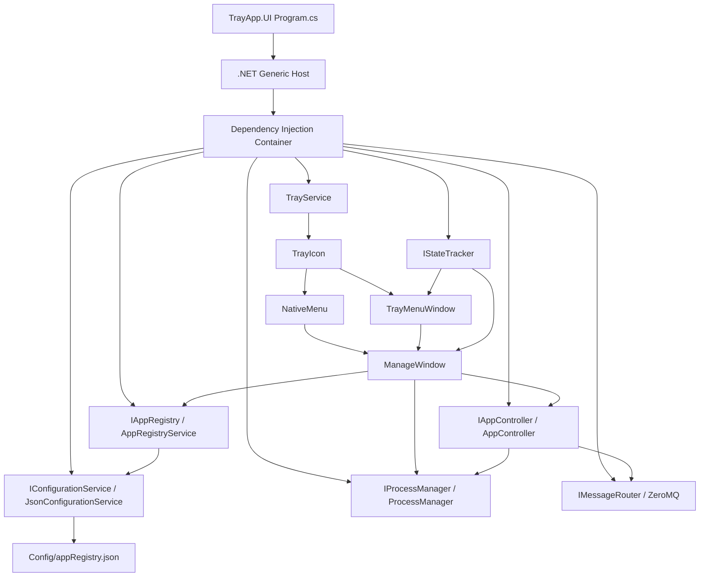

# AppHive UI Runtime and Theme Architecture

## 1. Purpose

This document describes how the AppHive application starts, how the tray icon is connected to the UI, how tray and management buttons are created at runtime, and how Avalonia styles are applied to those controls.

It also documents the boundaries where runtime failures can occur, especially when a project compiles successfully but a window or control fails when it is created or hovered.

## 2. Application Startup

The UI starts in `src/TrayApp.UI/Program.cs`.

Startup sequence:

1. `Host.CreateDefaultBuilder(args)` creates the .NET Generic Host.
2. `ConfigureServices` registers application services in the DI container.
3. `host.StartAsync()` starts hosted services, including the orchestrator.
4. `TrayApp.UI.App.Host` receives the host instance.
5. Avalonia starts with `StartWithClassicDesktopLifetime(args)`.
6. Avalonia calls `App.OnFrameworkInitializationCompleted()`.
7. `TrayService` is resolved from DI. Resolving it constructs the service and initializes the tray icon.

Important registrations:

```csharp
services.AddSingleton<IAppController, AppController>();
services.AddSingleton<IConfigurationService, JsonConfigurationService>();
services.AddSingleton<IAppRegistry, AppRegistryService>();
services.AddSingleton<IStateTracker, InMemoryStateTracker>();
services.AddSingleton<IMessageRouter, ZeroMqMessageRouter>();
services.AddSingleton<IProcessManager, ProcessManager>();
services.AddHostedService<Orchestrator>();
services.AddSingleton<TrayService>();
```

The UI does not start with a normal main window. It uses:

```csharp
desktop.ShutdownMode = ShutdownMode.OnExplicitShutdown;
```

The tray icon is the primary entry point.

## 3. Service and Data Flow



### Configuration path

`JsonConfigurationService` owns JSON serialization and deserialization. `AppRegistryService` owns the mutable in-memory configuration used by the application.

The relationship is:

```text
JSON file
  -> JsonConfigurationService.Load()
  -> AppConfiguration
  -> AppRegistryService
  -> IAppRegistry consumers
```

On changes:

```text
UI action
  -> IAppRegistry.AddApp / UpdateApp / RemoveApp / SetHidden
  -> AppRegistryService mutates AppConfiguration
  -> JsonConfigurationService.Save(configuration)
  -> Config/appRegistry.json
```

The configuration model is `AppConfiguration` and contains:

- `Apps: List<AppInfo>`
- `ZeroMq: ZeroMqConfig`
- `Notifications: NotificationConfig`

`Notifications.Enabled` is serialized as `notifications.enabled`. It defaults to `true` when older configuration files do not contain the property. The Settings window persists this value with the ZeroMQ endpoints.

`AppInfo` maps the C# properties to the JSON names:

| C# property | JSON property |
|---|---|
| `Id` | `appId` |
| `Name` | `name` |
| `ExecutablePath` | `executablePath` |
| `Args` | `args` |
| `StartCommand` | `startCommand` |
| `ZmqEndpoint` | `zmqEndpoint` |
| `Category` | `category` |
| `IsHidden` | `hidden` |

## 4. Tray Initialization

`TrayService.InitializeTray()` performs the following operations:

1. Checks that Avalonia is running with `IClassicDesktopStyleApplicationLifetime`.
2. Loads the optional tray icon file.
3. Creates an Avalonia `TrayIcon`.
4. Builds the native operating-system menu with `BuildNativeMenu`.
5. Subscribes to tray clicks.
6. Subscribes to `IStateTracker.StatusUpdated`.
7. Starts a three-second status polling timer.

When a status update transitions from a non-stopped state to `stopped`, `TrayService` checks `IAppRegistry.NotificationsEnabled`. If enabled, `WindowsToastNotificationService` sends one Windows notification balloon containing the managed application name. The previous status is cached to prevent repeated notifications during polling. Notification delivery is best effort and is skipped on non-Windows platforms.

The tray icon has two separate UI surfaces:

### Native tray menu

Created by `BuildNativeMenu()` using:

- `NativeMenu`
- `NativeMenuItem`
- `NativeMenuItemSeparator`

This menu is rendered by the operating system. Avalonia window styles do not control its colors or hover behavior.

The native menu contains:

- One submenu per visible application
- Start application
- Stop application
- Status
- Manage applications
- Quit AppHive

### Custom popup tray menu

Created by `ShowTrayMenu()` using `TrayMenuWindow`.

This is a normal Avalonia `Window` with:

```xml
ShowInTaskbar="False"
SystemDecorations="None"
Topmost="True"
CanResize="False"
```

The popup is shown on the UI thread with `Dispatcher.UIThread.Post`. It is positioned after the first layout pass by posting a second dispatcher callback. This is important because `ClientSize` is not reliable until Avalonia has measured and arranged the window.

The popup also has a maximum-height `ScrollViewer` around the application list so a long list does not extend below the screen.

## 5. TrayMenuWindow Runtime Controls

`TrayMenuWindow.axaml` declares the static controls:

- Header text
- Application list container: `AppItemsPanel`
- `SettingsButton`
- `ExitButton`

The application rows are not declared in XAML. They are created in `TrayMenuWindow.axaml.cs`.

### Application filtering

Only applications satisfying all of these conditions are added to the tray popup:

```csharp
!app.IsHidden
!string.IsNullOrWhiteSpace(app.Id)
!string.IsNullOrWhiteSpace(app.Name)
```

An invalid or hidden application does not get a runtime row.

### Runtime row structure

For each visible application, `AddAppItem` creates:

```text
Grid row
  TextBlock application name
  TextBlock status
  StackPanel actions
    Button Start
    Button Stop
```

The buttons are instantiated in C#:

```csharp
var start = new Button
{
    Content = MenuButtonText("Start"),
    Classes = { "menu-action" },
    HorizontalContentAlignment = HorizontalAlignment.Left
};
```

The content is an explicit `TextBlock`, rather than a raw string. This matters because Fluent button templates can style a generated content presenter differently during pointer-over and pressed states.

`MenuButtonText` assigns an explicit foreground brush to the text block:

```csharp
private static TextBlock MenuButtonText(string text)
{
    return new TextBlock
    {
        Text = text,
        Foreground = (IBrush)Application.Current!.FindResource("PrimaryTextBrush")!,
        FontSize = 13
    };
}
```

### Runtime event handlers

The Start button calls:

```text
_controller.StartAsync(app.Id)
_update status to starting
```

The Stop button calls:

```text
_controller.StopAsync(app.Id)
_update status to stopping
```

These handlers are asynchronous event handlers. Exceptions thrown inside them should be caught and logged if the action can fail at runtime.

## 6. ManageWindow Runtime Controls

`ManageWindow.axaml` contains the layout and form controls. `ManageWindow.axaml.cs` creates the application rows dynamically.

Static controls include:

- Search box
- Refresh button
- Application form
- Configuration form
- Add/save button
- Cancel edit button
- Publisher and subscriber endpoint fields

For each application, `CreateAppRow` creates:

```text
Border
  StackPanel
    Grid header
      StackPanel identity
        TextBlock app name
        TextBlock app ID
      StackPanel status
        Ellipse status dot
        TextBlock status text
    StackPanel actions
      Start
      Stop
      Restart
      Hide/Show
      Delete
```

The row also receives a `ContextMenu` with:

- Edit
- Hide from tray or Show in tray
- Delete

The app name has a double-click handler that calls `BeginEdit(app)` and fills the form.

## 7. Theme Application Order

Avalonia styles are applied by scope and selector specificity. In this project, the effective order is conceptually:

1. Fluent theme defaults from `FluentTheme`.
2. Application-wide styles in `App.axaml`.
3. Window-local styles in the individual `.axaml` window.
4. Classes assigned to a control, such as `menu-action`, `action`, or `primary`.
5. Pseudo-classes such as `:pointerover`, `:pressed`, `:focus`, and `:disabled`.
6. Direct property values assigned in C#.
7. Properties on generated child controls, such as the explicit `TextBlock` used inside tray buttons.

A later or more-specific selector can override an earlier value. This is why a button can have a visible normal foreground but an invisible hover foreground.

### Important pseudo-classes

Use Avalonia selectors:

```xml
Button:pointerover
Button:pressed
TextBox:focus
```

Do not use ordinary web CSS assumptions such as `:hover` when the Avalonia version expects `:pointerover`.

### Current application-wide button rules

`App.axaml` supplies baseline rules:

```xml
<Style Selector="Button">
    <Setter Property="Foreground" Value="{DynamicResource PrimaryTextBrush}" />
    <Setter Property="BorderThickness" Value="1" />
</Style>

<Style Selector="Button:pointerover">
    <Setter Property="Foreground" Value="#FFFFFF" />
</Style>

<Style Selector="Button:pressed">
    <Setter Property="Foreground" Value="#FFFFFF" />
</Style>
```

The child-text rules are used for runtime-generated text content:

```xml
<Style Selector="Button:pointerover TextBlock">
    <Setter Property="Foreground" Value="#FFFFFF" />
</Style>
```

### Tray menu button rules

`TrayMenuWindow.axaml` adds the `menu-action` class styling:

```xml
<Style Selector="Button.menu-action">
    <Setter Property="Background" Value="Transparent" />
    <Setter Property="BorderBrush" Value="Transparent" />
    <Setter Property="BorderThickness" Value="1" />
    <Setter Property="Foreground" Value="{DynamicResource PrimaryTextBrush}" />
</Style>

<Style Selector="Button.menu-action:pointerover">
    <Setter Property="Background" Value="#344B59" />
    <Setter Property="BorderBrush" Value="{DynamicResource AccentBrush}" />
    <Setter Property="Foreground" Value="#FFFFFF" />
</Style>

<Style Selector="Button.menu-action:pressed">
    <Setter Property="Background" Value="#1C2A33" />
    <Setter Property="BorderBrush" Value="{DynamicResource AccentHoverBrush}" />
    <Setter Property="Foreground" Value="#FFFFFF" />
</Style>
```

The `accent` class has more-specific rules for the footer buttons. Those rules must also specify `Foreground`, because the class selector can override the base hover rule.

## 8. TextBox Theme Behavior

The application uses a dark input surface:

```xml
<Style Selector="TextBox">
    <Setter Property="Foreground" Value="{DynamicResource PrimaryTextBrush}" />
    <Setter Property="Background" Value="{DynamicResource InputBackgroundBrush}" />
    <Setter Property="CaretBrush" Value="{DynamicResource AccentBrush}" />
    <Setter Property="SelectionBrush" Value="{DynamicResource AccentBrush}" />
    <Setter Property="SelectionForegroundBrush" Value="#071614" />
</Style>
```

Focused and pointer-over states explicitly retain the dark background and light foreground.

Window-local classes provide the border and padding:

```xml
<Style Selector="TextBox.field">
    <Setter Property="Background" Value="{DynamicResource InputBackgroundBrush}" />
    <Setter Property="BorderBrush" Value="{DynamicResource PanelBorderBrush}" />
    <Setter Property="Foreground" Value="{DynamicResource PrimaryTextBrush}" />
</Style>
```

If entered text becomes invisible, check these values in order:

1. `TextBox.Foreground`
2. `TextBox.Background`
3. `TextBox:focus` foreground/background
4. `TextBox:pointerover` foreground/background
5. `SelectionForegroundBrush` while text is selected
6. Fluent template rules that may be setting the inner text presenter color

Avoid adding unsupported or overly broad `/template/` selectors until the exact Avalonia control template has been verified. They can compile but still fail when the control is instantiated.

## 9. Why Build Success Does Not Prove Runtime UI Success

The project uses compiled XAML, but several controls are created dynamically and some windows have constructor dependencies. Therefore, these are separate validation layers:

### Compile validation

```powershell
dotnet build TrayAppManager.sln --no-restore
```

This catches C# and compiled XAML syntax errors.

### Startup validation

```powershell
dotnet run --project src/TrayApp.UI
```

This catches DI startup, tray initialization, icon loading, and hosted-service errors.

### Window creation validation

Open the tray popup and then select `Manage applications`. This creates `ManageWindow`, initializes all named controls, and executes its constructor logic.

### Interaction validation

Test each state separately:

- Move the mouse over Start, Stop, and footer buttons.
- Press and release each button.
- Focus every TextBox and type text.
- Select text in every TextBox.
- Open the category ComboBox and hover an item.
- Open the application context menu.
- Add, edit, hide/show, delete, start, stop, and restart an app.

## 10. Known Warning

The build currently reports an Avalonia warning similar to:

```text
XAML resource ... won't be reachable via runtime loader,
as no public constructor was found
```

This occurs because `TrayMenuWindow` and `ManageWindow` are constructed with dependency parameters rather than a public parameterless constructor. The application currently creates them directly in `TrayService`, so the warning does not necessarily mean direct construction fails.

A cleaner long-term design is one of these:

### Option A: Keep code construction

Keep constructor injection and treat the XAML files as compiled views used only by their code-behind classes.

### Option B: Introduce view factories

Register factories in DI:

```csharp
services.AddTransient<TrayMenuWindow>();
services.AddTransient<ManageWindow>();
```

Then create the windows through the service provider. This keeps dependencies explicit and makes construction easier to test.

### Option C: Use view models

Move registry/controller/process dependencies into a view model and let the view have a parameterless constructor. This is the most conventional Avalonia architecture, but it is a larger refactor.

## 11. Runtime Debugging Checklist

When a tray or management window fails:

1. Build with `dotnet build TrayAppManager.sln --no-restore`.
2. Run the UI from the repository root, not from a project folder if relative config paths matter.
3. Check the first exception thrown after the tray click.
4. Determine whether the failure occurs in:
   - `TrayService.ShowTrayMenu`
   - `TrayMenuWindow` constructor
   - `ManageWindow` constructor
   - XAML initialization
   - dynamic row creation
   - an event handler
5. Temporarily remove only the newest style selector or dynamic control property.
6. Rebuild and repeat the exact interaction.
7. Once the failing layer is confirmed, restore the intended style through the narrowest selector possible.

For styling bugs, always validate normal, pointer-over, pressed, focused, disabled, and selected states independently. A style that looks correct at startup may still be overridden by a more-specific Fluent template state during interaction.
